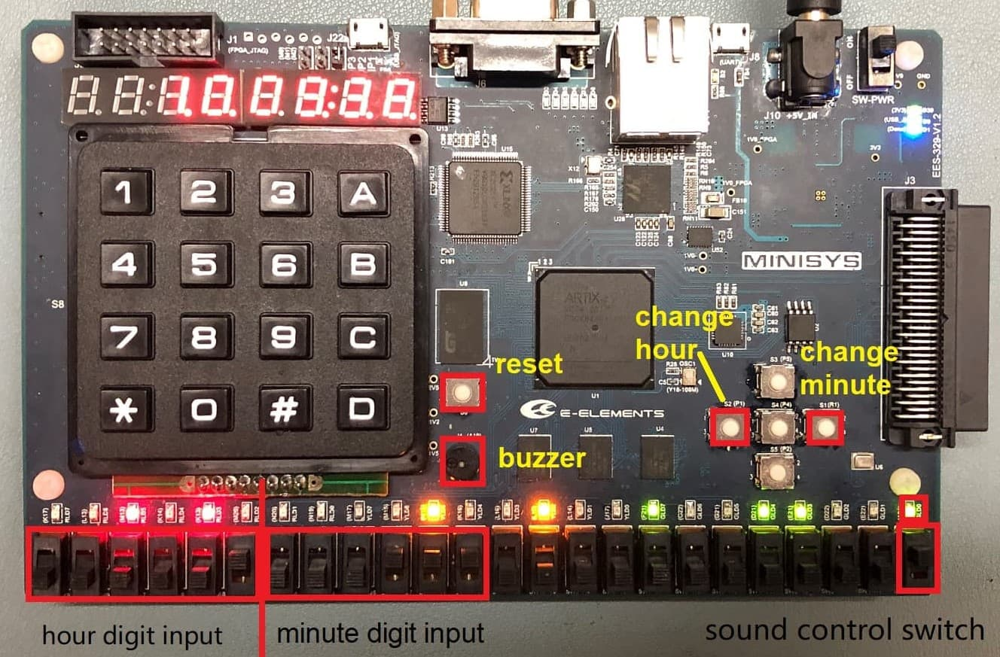
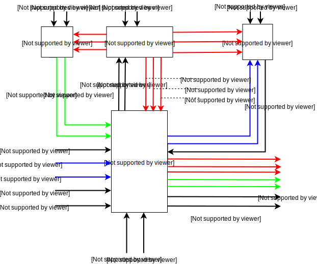

# CS207 Project Report

### 功能描述

#### 基础功能

1. 使用 6 个数码管实现时、分、秒的数字显示。
2. 可以设置当前时间。
3. 可以实现整点报时功能，并能控制启动和关闭。

#### 扩展功能

1. 可以调整打铃时间，播放铃声音乐。
2. 通过 LED 灯实现二进制输出时钟显示。
3. 一键时钟归零。


### 电路使用说明



#### 控制信号

开发板接受来自内部的``100MHz``的时钟作为时钟信号，以``S6``按钮作为重置按钮。右侧，``S2``和``S1``按钮被用作时钟调节按钮。下方的拨码开关中，左侧 12 个为闹钟时间设置开关，最右侧为蜂鸣器总开关。

#### 输出

键盘上方的七段数码管为时钟的数码输出，而下方的数个 LED 等则为时钟的“二进制输出”。``A19``为蜂鸣器；``A21`` (最右侧 LED 灯) 与下方拨码开关串联。

#### 功能实现

* 时间显示存在两种输出方式。
* 最右侧拨码开关控制蜂鸣器开关，可影响整点报时及闹钟功能。
* 左侧拨码开关用于闹钟时间设置。左侧 6 个设置小时位，右侧 6 个设置分钟位（二进制形式，非法输入将不会获得任何闹铃输出）。
* ``S2``用来调节时钟的小时位，``S1``用来调节时钟的分钟位。将按钮按住不动，小时数/分钟数将会增加。
* ``S6``用于重置整个电路。

### 设计描述



<center>本图中颜色相同的线段传递着相同的信息流。出于版面原因，无法写全所有输入或输出的名字。</center>

本程序共含有 4 个基本模块。其中，状态机 (StateMachine) 模块为主程序入口；显示 (display) 、时钟 (clock) 及声音 (sound) 模块与状态机模块进行交互，并受其控制以处理信息。

#### 主模块

主模块存在 7 个输入：

* ``sound_on`` ，控制蜂鸣器总开关；
* ``h`` / ``min`` ，时间调节按钮；
* ``alhour`` / ``alminute`` ，闹钟设定时间；
* ``clk`` / ``rst`` ，时钟信号和重置信号。

同时，有 7 个输出：

* ``hour`` / ``minute`` / ``second`` ，二进制时钟控制信号；
* ``seg_out`` / ``seg_en`` ， 数码管控制信号；
* ``speak`` ，控制蜂鸣器输出；
* ``speak_on_led`` ，蜂鸣器开关 LED 灯。

#### 时钟模块

时钟模块存在来自主模块的``h`` / ``min`` 输入，控制时间调整；输出用于显示时间的变量至其他三个模块。

#### 显示模块

显示模块读入来自时钟模块的时间变量信号，并将其转化为用于七段数码管显示的信号，输出至主模块。

#### 声音模块

声音模块读入来自时钟模块的时间变量信号，和来自主模块的闹钟设置信号，输出对于蜂鸣器的控制信号``speak``至主模块。


### 核心代码说明

#### 时钟设计

时钟模块的功能主要分为时钟分频和调整时间两块。分频模块分出频率是``1Hz``的``clk_bps``信号和频率是``4Hz``的``clk_fbps``信号。秒钟随着``clk_bps``信号的跳动而跳动；而分钟和时钟在调时按钮未被按下时，也相当于一个分频器，分钟在秒数为 59 的下一刻跳动，时钟在分钟数和秒数都为 59 的下一刻跳动。时分秒在到达最大值（23，59，59）后跳至0。

在调时按钮按下时，对应的时钟或分钟随``clk_fbps``信号的跳动而跳动，在适当的时候松开调时按钮，对应的时钟或分钟停止跳动，达到调整时间的目的。``clk_fbps``信号``4Hz``的频率比较适当，使得调整时间时既不会用时过久，也不会因为跳动太快导致无法准确调整时间。

#### 声音设计

声音的频率在设计中通过调整一秒内响铃翻转的次数实现，这个次数是二倍频率。通过每一次翻转间隔的时间，即计时器变化的次数来确定是否翻转。这个次数，经过计算为 $$100000000 / 2 / 声音频率 = 50000000/声音频率 $$。然后，查询各个音的频率即可编写谱子。
查询结果如所示：( 频率单位为``Hz`` )

|   C   |   D   |   E   |   F   |  G   |  A   |   B   |
| :---: | :---: | :---: | :---: | :--: | :--: | :---: |
|  do   |  re   |  mi   |  fa   | sol  |  la  |  si   |
| 261.6 | 293.6 | 329.6 | 349.2 | 392  | 440  | 493.8 |

高一个八度频率乘2，反之除以2。

在本实验中，为闹铃编曲，类似平时打铃的声音，谱子为

```
6--4--5--1----|1--5--6--4----|1----1----1----
```

为了让整点报时与闹钟不冲突，人为规定闹钟铃声对于整点报时有覆盖作用。
对整点报时来说，为了体现报时的特点，我们想加入能体现到底是几点的设置，决定在几点就响几下。由于 23 次耗时过长，我们采取 12 小时制，并且为了让每个整点都会响，我们采取 1 - 24 点的方式，在 0 点（即 24 点）响铃12下。由于希望每过一秒响一次，所以与闹铃一样，对每一秒是否响进行代码的书写。在代码书写中使用了枚举法，内容较长。


#### 显示模块

显示模块通过七段数码管实现。由于在组合逻辑电路中，8位数码管只可以显示相同的数字，在这里使用时序逻辑设计电路。若数码管每一位显示的时间足够短，在观感上就好像数码管在同时显示不同的数字一样。经过实验，``500Hz``是一个可以接受的闪烁频率。

本模块中，先将输入的二进制时/分/秒数转换为数位的形式以方便处理。其后，扫描数码管的各个位，使用``seg_en``和``seg_out``搭配，输出指定的数字。

#### 展示后的修改

增加了设置闹钟时间的功能：为了方便用户自己设置闹钟的时间，使用拨码开关作为闹钟时间设置的输入。

### 总结

#### 问题

* 在编写调整时钟时间的功能时，曾先后想到过利用键盘或者拨码开关进行调整的方案，但是在实现时由于不明原因导致程序不能正常运行。后来通过两个按钮（分别对应时钟和分钟）控制时钟快速跳动的方法实现了调整时钟时间的功能。
* 闹铃和报时的功能的冲突控制：一开始是写了两个模块，但当合在一起是会报错，原因是``speak``同时在两个模块中赋值。后将两部分合并至一个模块，并且通过条件句画出先后顺序，解决问题。
* 仿真的困难性，因为频率是一个很重要的参量，但其对应的值过于大，无法用仿真确定是否声音满足条件。后直接对设计文件综合，实现，对成品进行检查。
* 声音设计中，由于能力的原因，将每一秒的声音频率写进了代码中故以代码较长，且闹钟不能对秒进行设置。并且无法完全控制闹钟的停止。当停止闹钟再立刻打开时，声音会继续响：因为只关闭了蜂鸣器，当打开后会锋鸣器继续工作。

#### 项目创新点

* 时间信号可以通过二进制方式显示，别有一番风味；
* 实现了声音频率的控制，并且能编写打铃的谱子；
* 实现了闹铃和报时的功能并解决了时间相互冲突的情况。

